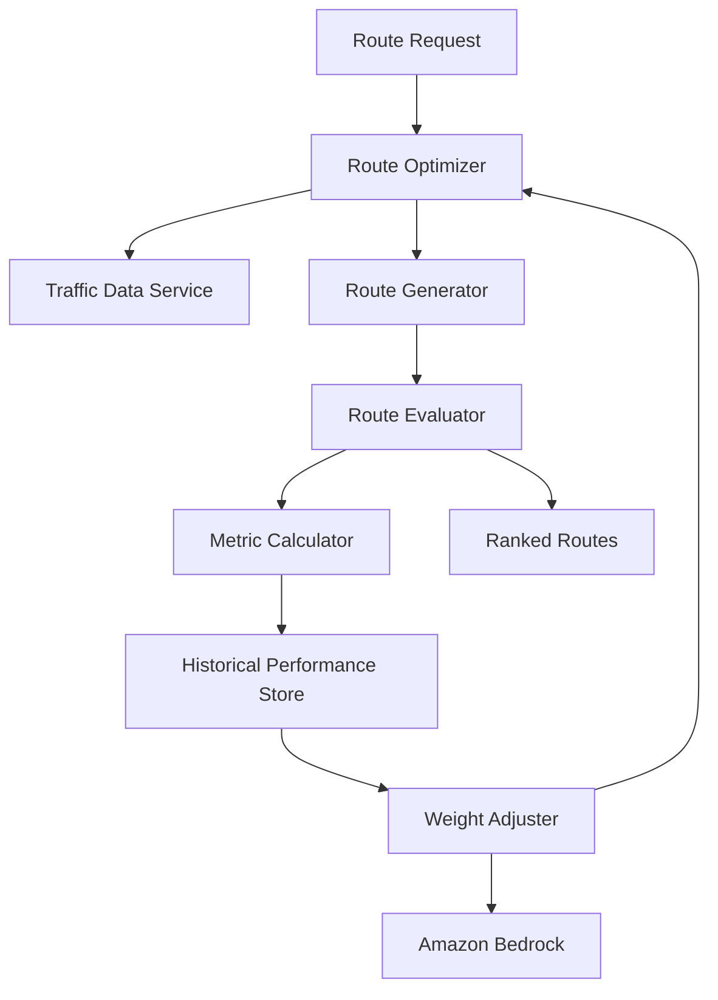

# Design Document: Agentic Route Optimizer

## Overview

The Agentic Route Optimizer is a machine learning-based system that continuously improves carpooling route recommendations through reinforcement learning. The system integrates with traffic data APIs, evaluates routes using weighted metrics (time, distance, reliability), and uses Amazon Bedrock's foundation models to learn optimal metric weights from historical performance data.

### Key Design Principles

1. **Separation of Concerns**: Traffic data retrieval, route generation, evaluation, and learning are independent modules
2. **Data-Driven Learning**: All weight adjustments are based on empirical performance data, not assumptions
3. **Incremental Adaptation**: Weight changes are gradual to prevent instability
4. **Fallback Mechanisms**: System degrades gracefully when external services are unavailable
5. **Observability**: All decisions and weight changes are logged for analysis

### Technology Stack

- **Language**: TypeScript (React Native/Expo environment)
- **AI Service**: Amazon Bedrock (AWS SDK for JavaScript v3)
- **Storage**: Local SQLite for historical data, AsyncStorage for configuration
- **Testing**: Jest for unit tests, fast-check for property-based tests
- **Traffic Data**: Integration with traffic API (Google Maps, HERE, or similar)

## Architecture

### System Components



### Component Responsibilities

1. **Route Optimizer**: Orchestrates the route generation and evaluation process
2. **Traffic Data Service**: Retrieves and caches traffic information
3. **Route Generator**: Creates multiple distinct route options
4. **Route Evaluator**: Scores routes using weighted metrics
5. **Metric Calculator**: Computes time, distance, and reliability metrics
6. **Historical Performance Store**: Persists and queries route performance data
7. **Weight Adjuster**: Analyzes patterns and adjusts metric weights using AI
8. **Amazon Bedrock Client**: Interfaces with AWS Bedrock foundation models


## Components and Interfaces

### 1. Traffic Data Service

**Purpose**: Retrieve and cache traffic data from external APIs

**Interface**:
```typescript
interface TrafficDataService {
  getCurrentTraffic(area: GeographicArea): Promise<TrafficData>;
  getHistoricalTraffic(area: GeographicArea, timeRange: TimeRange): Promise<HistoricalTrafficData>;
  getCachedTraffic(area: GeographicArea): TrafficData | null;
}

interface TrafficData {
  roadSegments: RoadSegment[];
  timestamp: Date;
  source: string;
}

interface RoadSegment {
  id: string;
  coordinates: Coordinate[];
  speedKmh: number;
  congestionLevel: 'low' | 'medium' | 'high' | 'severe';
  incidents: Incident[];
}

interface HistoricalTrafficData {
  roadSegmentId: string;
  measurements: TrafficMeasurement[];
}

interface TrafficMeasurement {
  timestamp: Date;
  speedKmh: number;
  travelTimeSeconds: number;
}
```

**Implementation Notes**:
- Cache traffic data for 5 minutes to reduce API calls
- Implement exponential backoff for API failures
- Log warnings when using cached data due to API unavailability

### 2. Route Generator

**Purpose**: Generate multiple distinct route options for a set of locations

**Interface**:
```typescript
interface RouteGenerator {
  generateRoutes(request: RouteRequest): Promise<Route[]>;
}

interface RouteRequest {
  pickupLocations: Location[];
  dropoffLocations: Location[];
  departureTime: Date;
  constraints?: RouteConstraints;
}

interface Route {
  id: string;
  waypoints: Waypoint[];
  segments: RouteSegment[];
  metadata: RouteMetadata;
}

interface Waypoint {
  location: Location;
  type: 'pickup' | 'dropoff';
  sequenceNumber: number;
  estimatedArrivalTime: Date;
}

interface RouteSegment {
  startLocation: Location;
  endLocation: Location;
  roadSegmentIds: string[];
  distanceMeters: number;
  estimatedDurationSeconds: number;
}
```

**Implementation Notes**:
- Use permutation-based approach to generate different waypoint orderings
- Apply constraints (max detour, time windows) to filter invalid routes
- Generate at least 3 distinct routes when possible
- Use A* or Dijkstra's algorithm for pathfinding between waypoints


### 3. Metric Calculator

**Purpose**: Calculate time, distance, and reliability metrics for routes

**Interface**:
```typescript
interface MetricCalculator {
  calculateMetrics(route: Route, trafficData: TrafficData, historicalData: HistoricalTrafficData[]): RouteMetrics;
}

interface RouteMetrics {
  timeMinutes: number;
  distanceKm: number;
  reliability: number; // 0-1 scale, higher is more reliable
  rawMetrics: {
    timeVariance: number;
    distanceVariance: number;
    measurementCount: number;
  };
}
```

**Implementation Notes**:
- **Time Calculation**: Sum segment durations using current traffic speeds
- **Distance Calculation**: Sum segment distances
- **Reliability Calculation**: 
  - Compute coefficient of variation (CV = stddev / mean) for each segment
  - Weight recent measurements more heavily (exponential decay)
  - Aggregate segment CVs using weighted average by segment length
  - Convert CV to 0-1 scale: reliability = 1 / (1 + CV)
  - Assign default reliability of 0.3 when fewer than 10 measurements exist

### 4. Route Evaluator

**Purpose**: Score and rank routes using weighted metrics

**Interface**:
```typescript
interface RouteEvaluator {
  evaluateRoutes(routes: Route[], weights: MetricWeights): ScoredRoute[];
}

interface MetricWeights {
  time: number;      // 0-1, sum of all weights = 1
  distance: number;  // 0-1
  reliability: number; // 0-1
}

interface ScoredRoute {
  route: Route;
  metrics: RouteMetrics;
  normalizedMetrics: NormalizedMetrics;
  score: number; // 0-1, higher is better
}

interface NormalizedMetrics {
  time: number;       // 0-1, normalized across all routes
  distance: number;   // 0-1
  reliability: number; // 0-1
}
```

**Implementation Notes**:
- Normalize each metric to 0-1 scale using min-max normalization across all candidate routes
- For time and distance: normalized = (max - value) / (max - min) (lower is better)
- For reliability: normalized = value (higher is better)
- Calculate score: score = (weights.time × norm.time) + (weights.distance × norm.distance) + (weights.reliability × norm.reliability)
- Sort routes by score in descending order


### 5. Historical Performance Store

**Purpose**: Persist and query route performance data for learning

**Interface**:
```typescript
interface HistoricalPerformanceStore {
  recordPerformance(performance: RoutePerformance): Promise<void>;
  queryPerformance(query: PerformanceQuery): Promise<RoutePerformance[]>;
  getPerformanceStats(): Promise<PerformanceStats>;
}

interface RoutePerformance {
  id: string;
  routeId: string;
  plannedMetrics: RouteMetrics;
  actualMetrics: ActualMetrics;
  weights: MetricWeights;
  timestamp: Date;
  completed: boolean;
}

interface ActualMetrics {
  actualTimeMinutes: number;
  actualDistanceKm: number;
  deviationFromPlan: {
    timeDeviationMinutes: number;
    distanceDeviationKm: number;
  };
}

interface PerformanceQuery {
  startDate?: Date;
  endDate?: Date;
  minCompletedRoutes?: number;
  routeCharacteristics?: RouteCharacteristics;
}

interface PerformanceStats {
  totalRoutes: number;
  completedRoutes: number;
  averageTimeDeviation: number;
  averageDistanceDeviation: number;
}
```

**Implementation Notes**:
- Use SQLite for local storage with indexed queries
- Retain data for 90 days, then archive or delete
- Index on timestamp and completed status for fast queries
- Store weights used for each route to correlate with outcomes


### 6. Weight Adjuster

**Purpose**: Use AI to analyze performance patterns and adjust metric weights

**Interface**:
```typescript
interface WeightAdjuster {
  analyzeAndAdjust(): Promise<WeightAdjustmentResult>;
  proposeWeights(analysis: PerformanceAnalysis): Promise<MetricWeights>;
}

interface WeightAdjustmentResult {
  previousWeights: MetricWeights;
  proposedWeights: MetricWeights;
  appliedWeights: MetricWeights;
  justification: string;
  confidence: number; // 0-1
}

interface PerformanceAnalysis {
  performances: RoutePerformance[];
  correlations: {
    timeWeightVsDeviation: number;
    distanceWeightVsDeviation: number;
    reliabilityWeightVsDeviation: number;
  };
  trends: {
    improvingMetrics: string[];
    decliningMetrics: string[];
  };
}
```

**Implementation Notes**:
- Run analysis when at least 50 completed routes exist
- Query Amazon Bedrock with structured prompt containing performance data
- Use Claude 3 Sonnet or similar model for analysis
- Prompt structure:
  ```
  Analyze route performance data and recommend metric weight adjustments.
  
  Current weights: {time: X, distance: Y, reliability: Z}
  Performance data: [summary statistics]
  Correlations: [weight-to-outcome correlations]
  
  Recommend new weights that minimize route deviation while maintaining balance.
  Provide justification and confidence score.
  ```
- Validate proposed weights: sum = 1.0, all non-negative
- Apply incremental adjustment: new_weight = 0.7 × old_weight + 0.3 × proposed_weight
- Store adjustment history for audit trail


### 7. Amazon Bedrock Client

**Purpose**: Interface with AWS Bedrock foundation models

**Interface**:
```typescript
interface BedrockClient {
  invokeModel(request: BedrockRequest): Promise<BedrockResponse>;
}

interface BedrockRequest {
  modelId: string; // e.g., "anthropic.claude-3-sonnet-20240229-v1:0"
  prompt: string;
  parameters: {
    temperature: number;
    topP: number;
    maxTokens: number;
  };
}

interface BedrockResponse {
  content: string;
  usage: {
    inputTokens: number;
    outputTokens: number;
  };
}
```

**Implementation Notes**:
- Use AWS SDK for JavaScript v3 (@aws-sdk/client-bedrock-runtime)
- Configure credentials via environment variables or IAM roles
- Implement exponential backoff for rate limiting (429 errors)
- Set timeout to 30 seconds
- Parse JSON responses from model outputs
- Fallback to heuristic-based weight adjustment if Bedrock unavailable

### 8. Route Optimizer (Orchestrator)

**Purpose**: Coordinate all components to generate and evaluate routes

**Interface**:
```typescript
interface RouteOptimizer {
  optimizeRoute(request: RouteRequest): Promise<OptimizationResult>;
  recordActualPerformance(routeId: string, actual: ActualMetrics): Promise<void>;
}

interface OptimizationResult {
  rankedRoutes: ScoredRoute[];
  currentWeights: MetricWeights;
  metadata: {
    generationTimeMs: number;
    routesGenerated: number;
    trafficDataAge: number;
  };
}
```

**Implementation Notes**:
- Load current weights from storage on initialization
- Orchestrate: traffic retrieval → route generation → metric calculation → evaluation
- Handle errors gracefully with fallbacks
- Log all operations for debugging


## Data Models

### Core Data Structures

```typescript
// Geographic primitives
interface Location {
  latitude: number;
  longitude: number;
  address?: string;
}

interface Coordinate {
  lat: number;
  lng: number;
}

interface GeographicArea {
  bounds: {
    north: number;
    south: number;
    east: number;
    west: number;
  };
}

// Time primitives
interface TimeRange {
  start: Date;
  end: Date;
}

// Route constraints
interface RouteConstraints {
  maxDetourMinutes?: number;
  maxTotalTimeMinutes?: number;
  timeWindows?: TimeWindow[];
}

interface TimeWindow {
  locationIndex: number;
  earliestTime: Date;
  latestTime: Date;
}

// Incidents
interface Incident {
  type: 'accident' | 'construction' | 'closure' | 'other';
  severity: 'minor' | 'moderate' | 'major';
  description: string;
}

// Route characteristics (for querying similar routes)
interface RouteCharacteristics {
  approximateDistance?: number;
  approximateTime?: number;
  numberOfWaypoints?: number;
  timeOfDay?: 'morning' | 'midday' | 'evening' | 'night';
}

// Metadata
interface RouteMetadata {
  generatedAt: Date;
  trafficDataTimestamp: Date;
  algorithmVersion: string;
}
```

### Database Schema (SQLite)

```sql
-- Route performance history
CREATE TABLE route_performances (
  id TEXT PRIMARY KEY,
  route_id TEXT NOT NULL,
  planned_time_minutes REAL NOT NULL,
  planned_distance_km REAL NOT NULL,
  planned_reliability REAL NOT NULL,
  actual_time_minutes REAL,
  actual_distance_km REAL,
  time_deviation_minutes REAL,
  distance_deviation_km REAL,
  weight_time REAL NOT NULL,
  weight_distance REAL NOT NULL,
  weight_reliability REAL NOT NULL,
  timestamp INTEGER NOT NULL,
  completed INTEGER NOT NULL,
  created_at INTEGER NOT NULL
);

CREATE INDEX idx_timestamp ON route_performances(timestamp);
CREATE INDEX idx_completed ON route_performances(completed);

-- Weight adjustment history
CREATE TABLE weight_adjustments (
  id TEXT PRIMARY KEY,
  previous_time REAL NOT NULL,
  previous_distance REAL NOT NULL,
  previous_reliability REAL NOT NULL,
  new_time REAL NOT NULL,
  new_distance REAL NOT NULL,
  new_reliability REAL NOT NULL,
  justification TEXT NOT NULL,
  confidence REAL NOT NULL,
  routes_analyzed INTEGER NOT NULL,
  timestamp INTEGER NOT NULL
);

CREATE INDEX idx_adjustment_timestamp ON weight_adjustments(timestamp);
```

### Configuration Storage (AsyncStorage)

```typescript
// Keys for AsyncStorage
const CONFIG_KEYS = {
  CURRENT_WEIGHTS: 'route_optimizer.weights.current',
  LAST_ADJUSTMENT: 'route_optimizer.weights.last_adjustment',
  ADJUSTMENT_INTERVAL: 'route_optimizer.config.adjustment_interval',
  MIN_ROUTES_THRESHOLD: 'route_optimizer.config.min_routes_threshold',
};

// Default configuration
const DEFAULT_CONFIG = {
  weights: {
    time: 0.4,
    distance: 0.3,
    reliability: 0.3,
  },
  adjustmentIntervalHours: 24,
  minRoutesThreshold: 50,
  maxWeightChange: 0.15, // Maximum change per adjustment
};
```


## Correctness Properties

*A property is a characteristic or behavior that should hold true across all valid executions of a system—essentially, a formal statement about what the system should do. Properties serve as the bridge between human-readable specifications and machine-verifiable correctness guarantees.*

### Property 1: Historical traffic data completeness
*For any* time period and geographic location, when historical traffic data is requested, the response should contain aggregated measurements with timestamps, speeds, and travel times for the requested period.
**Validates: Requirements 1.2**

### Property 2: Traffic data structure validation
*For any* traffic data response from the service, it should contain speed, congestion level, and incident information for all road segments.
**Validates: Requirements 1.4**

### Property 3: Traffic data validation before use
*For any* retrieved traffic data, the Route_Optimizer should validate completeness (all required fields present) before using it for calculations.
**Validates: Requirements 1.5**

### Property 4: Route metrics calculation
*For any* route with traffic data, the calculated metrics should include time (based on traffic and distance), total distance (sum of all segments), and reliability (based on historical variance).
**Validates: Requirements 2.1, 2.2, 2.3**

### Property 5: Weighted score calculation
*For any* set of normalized metrics and weights, the route score should equal the weighted sum: (weight_time × norm_time) + (weight_distance × norm_distance) + (weight_reliability × norm_reliability).
**Validates: Requirements 2.4**

### Property 6: Score recalculation on weight change
*For any* set of routes and new weights, when weights are updated, all route scores should be recalculated using the new weights.
**Validates: Requirements 2.5**

### Property 7: Metric normalization bounds
*For any* set of route metrics, after normalization, all normalized values should be in the range [0, 1].
**Validates: Requirements 2.6**

### Property 8: Minimum route generation
*For any* valid set of pickup and dropoff locations where at least 3 distinct routes are possible, the Route_Optimizer should generate at least 3 route options.
**Validates: Requirements 3.1**

### Property 9: Route completeness
*For any* generated route, it should visit all required pickup and dropoff locations exactly once in a valid sequence.
**Validates: Requirements 3.2**

### Property 10: Route distinctness
*For any* set of generated routes, each route should have different characteristics (different waypoint ordering or different path segments).
**Validates: Requirements 3.3**

### Property 11: Route ranking order
*For any* set of scored routes, they should be ranked in descending order by score (highest score first).
**Validates: Requirements 3.4**

### Property 12: Performance data persistence
*For any* executed route, when performance is recorded, the stored data should include actual time, actual distance, completion status, route characteristics, timestamp, and the metric weights used.
**Validates: Requirements 4.1, 4.2, 4.6**

### Property 13: Historical data retrieval
*For any* route characteristics query, the Historical_Performance_Store should return all performance records matching those characteristics.
**Validates: Requirements 4.3**

### Property 14: Bedrock invocation for analysis
*For any* weight adjustment analysis, the Weight_Adjuster should invoke Amazon_Bedrock with historical performance data and current weights.
**Validates: Requirements 5.2, 6.1**

### Property 15: Weight proposal generation
*For any* performance analysis with sufficient data, the Weight_Adjuster should propose new metric weights.
**Validates: Requirements 5.3**

### Property 16: Weight constraint validation
*For any* proposed weights, they should satisfy: (1) all weights are non-negative, and (2) the sum of all weights equals 1.0 (within floating-point tolerance of 0.001).
**Validates: Requirements 5.4**

### Property 17: Incremental weight adjustment
*For any* weight adjustment, the change in each individual weight should not exceed the configured maximum change threshold (default 0.15).
**Validates: Requirements 5.5**

### Property 18: Weight adjustment logging
*For any* weight adjustment, the system should log both old and new weight values along with justification.
**Validates: Requirements 5.6**

### Property 19: Bedrock request configuration
*For any* Amazon_Bedrock request, it should include configured model parameters (temperature, top_p, maxTokens).
**Validates: Requirements 6.5**

### Property 20: Bedrock response validation
*For any* response from Amazon_Bedrock, the system should validate the response structure and sanitize the content before extracting weight recommendations.
**Validates: Requirements 6.6**

### Property 21: Reliability calculation from variance
*For any* road segment with at least 10 historical measurements, the reliability score should be calculated as 1 / (1 + CV) where CV is the coefficient of variation of time and distance measurements, with recent measurements weighted more heavily.
**Validates: Requirements 7.1, 7.2, 7.4, 7.5**

### Property 22: Error logging with context
*For any* error that occurs in any component, the system should log the error with detailed context including component name, operation, and relevant data.
**Validates: Requirements 8.5**


## Error Handling

### Traffic Data Service Errors

**Scenario**: External traffic API is unavailable or returns errors

**Handling**:
1. Implement exponential backoff: retry after 1s, 2s, 4s, 8s
2. After 4 failed attempts, use cached traffic data if available
3. Log warning with cache age when using cached data
4. If no cache available, return error to caller with clear message
5. Set cache TTL to 5 minutes for normal operations

**Error Types**:
- `TrafficServiceUnavailable`: API is down or unreachable
- `TrafficDataStale`: Using cached data older than 15 minutes
- `TrafficDataMissing`: No data available for requested area

### Route Generation Errors

**Scenario**: Cannot generate minimum number of routes

**Handling**:
1. Return all valid routes that could be generated
2. Log constraint that prevented generating more routes
3. Include metadata indicating fewer routes than requested
4. Do not fail the request - partial results are valuable

**Error Types**:
- `InsufficientRoutes`: Fewer than requested routes generated
- `NoValidRoutes`: No routes satisfy constraints
- `InvalidLocations`: Pickup/dropoff locations are invalid

### Amazon Bedrock Errors

**Scenario**: Bedrock API fails or returns invalid data

**Handling**:
1. Implement exponential backoff for rate limits (429)
2. Set 30-second timeout for Bedrock requests
3. On failure, use fallback heuristic weight adjustment:
   - If average time deviation > 10%, increase time weight by 0.05
   - If average distance deviation > 5%, increase distance weight by 0.05
   - Normalize weights to sum to 1.0
4. Log fallback usage for monitoring
5. Validate all Bedrock responses before applying

**Error Types**:
- `BedrockUnavailable`: Service is down or unreachable
- `BedrockRateLimited`: Too many requests
- `BedrockInvalidResponse`: Response doesn't match expected format
- `BedrockTimeout`: Request exceeded timeout

### Database Errors

**Scenario**: SQLite operations fail

**Handling**:
1. Wrap all database operations in try-catch
2. Log full error with SQL statement (sanitized)
3. For read failures: return empty results and log error
4. For write failures: retry once, then log and continue
5. Implement database health check on startup

**Error Types**:
- `DatabaseWriteError`: Failed to persist data
- `DatabaseReadError`: Failed to query data
- `DatabaseCorrupted`: Database file is corrupted

### Weight Validation Errors

**Scenario**: Proposed weights are invalid

**Handling**:
1. Validate weights before applying: sum = 1.0, all non-negative
2. If validation fails, log the invalid weights
3. Keep current weights unchanged
4. Schedule retry of weight adjustment for next interval
5. Alert if validation fails 3 times consecutively

**Error Types**:
- `InvalidWeights`: Weights don't sum to 1.0 or contain negative values
- `WeightAdjustmentFailed`: Could not compute new weights


## Testing Strategy

### Dual Testing Approach

The system requires both unit tests and property-based tests for comprehensive coverage:

- **Unit tests**: Verify specific examples, edge cases, and error conditions
- **Property tests**: Verify universal properties across all inputs

Both approaches are complementary and necessary. Unit tests catch concrete bugs in specific scenarios, while property tests verify general correctness across a wide range of inputs.

### Property-Based Testing

**Library**: fast-check (TypeScript property-based testing library)

**Configuration**:
- Minimum 100 iterations per property test (due to randomization)
- Each property test references its design document property
- Tag format: `// Feature: agentic-route-optimizer, Property {number}: {property_text}`

**Property Test Examples**:

```typescript
// Feature: agentic-route-optimizer, Property 7: Metric normalization bounds
it('should normalize all metrics to [0,1] range', () => {
  fc.assert(
    fc.property(
      fc.array(routeMetricsArbitrary(), { minLength: 2, maxLength: 10 }),
      (metrics) => {
        const normalized = normalizeMetrics(metrics);
        return normalized.every(m => 
          m.time >= 0 && m.time <= 1 &&
          m.distance >= 0 && m.distance <= 1 &&
          m.reliability >= 0 && m.reliability <= 1
        );
      }
    ),
    { numRuns: 100 }
  );
});

// Feature: agentic-route-optimizer, Property 16: Weight constraint validation
it('should validate weights sum to 1.0 and are non-negative', () => {
  fc.assert(
    fc.property(
      weightsArbitrary(),
      (weights) => {
        const isValid = validateWeights(weights);
        const sum = weights.time + weights.distance + weights.reliability;
        const allNonNegative = weights.time >= 0 && weights.distance >= 0 && weights.reliability >= 0;
        
        if (Math.abs(sum - 1.0) < 0.001 && allNonNegative) {
          expect(isValid).toBe(true);
        } else {
          expect(isValid).toBe(false);
        }
      }
    ),
    { numRuns: 100 }
  );
});
```

**Custom Arbitraries**:

```typescript
// Generate random route metrics
const routeMetricsArbitrary = () => fc.record({
  timeMinutes: fc.double({ min: 5, max: 180 }),
  distanceKm: fc.double({ min: 1, max: 100 }),
  reliability: fc.double({ min: 0, max: 1 }),
});

// Generate random weights (may be invalid)
const weightsArbitrary = () => fc.record({
  time: fc.double({ min: -0.5, max: 1.5 }),
  distance: fc.double({ min: -0.5, max: 1.5 }),
  reliability: fc.double({ min: -0.5, max: 1.5 }),
});

// Generate valid weights
const validWeightsArbitrary = () => fc.tuple(
  fc.double({ min: 0, max: 1 }),
  fc.double({ min: 0, max: 1 }),
  fc.double({ min: 0, max: 1 })
).map(([a, b, c]) => {
  const sum = a + b + c;
  return {
    time: a / sum,
    distance: b / sum,
    reliability: c / sum,
  };
});

// Generate random routes
const routeArbitrary = () => fc.record({
  id: fc.uuid(),
  waypoints: fc.array(waypointArbitrary(), { minLength: 2, maxLength: 10 }),
  segments: fc.array(segmentArbitrary(), { minLength: 1, maxLength: 9 }),
});
```

### Unit Testing

**Focus Areas**:
1. **Specific examples**: Test known scenarios with expected outcomes
2. **Edge cases**: Empty data, single waypoint, zero weights
3. **Error conditions**: API failures, invalid inputs, database errors
4. **Integration points**: Component interactions, data flow

**Unit Test Examples**:

```typescript
describe('TrafficDataService', () => {
  it('should use cached data when API is unavailable', async () => {
    // Specific example of fallback behavior
    const service = new TrafficDataService();
    const cachedData = mockTrafficData();
    service.setCache(area, cachedData);
    
    mockApiFailure();
    
    const result = await service.getCurrentTraffic(area);
    expect(result).toEqual(cachedData);
    expect(logger.warn).toHaveBeenCalledWith(expect.stringContaining('cache'));
  });
  
  it('should handle empty traffic data gracefully', async () => {
    // Edge case: no data available
    const service = new TrafficDataService();
    mockApiResponse({ roadSegments: [] });
    
    const result = await service.getCurrentTraffic(area);
    expect(result.roadSegments).toEqual([]);
  });
});

describe('WeightAdjuster', () => {
  it('should use fallback when Bedrock is unavailable', async () => {
    // Error condition: Bedrock failure
    const adjuster = new WeightAdjuster();
    mockBedrockFailure();
    
    const result = await adjuster.analyzeAndAdjust();
    expect(result.appliedWeights).toBeDefined();
    expect(logger.warn).toHaveBeenCalledWith(expect.stringContaining('fallback'));
  });
  
  it('should not adjust weights when fewer than 50 routes', async () => {
    // Edge case: insufficient data
    const adjuster = new WeightAdjuster();
    mockHistoricalData(30); // Only 30 routes
    
    const result = await adjuster.analyzeAndAdjust();
    expect(result).toBeNull();
  });
});

describe('RouteGenerator', () => {
  it('should generate exactly 3 routes for simple 2-location case', async () => {
    // Specific example with known outcome
    const generator = new RouteGenerator();
    const request = {
      pickupLocations: [location1],
      dropoffLocations: [location2],
      departureTime: new Date(),
    };
    
    const routes = await generator.generateRoutes(request);
    expect(routes.length).toBeGreaterThanOrEqual(1);
  });
});
```

### Integration Testing

**Scope**: Test component interactions and data flow

**Key Integration Tests**:
1. End-to-end route optimization flow
2. Weight adjustment cycle with real database
3. Bedrock integration with mock responses
4. Traffic data caching and fallback behavior

### Test Coverage Goals

- **Unit test coverage**: 80% of code lines
- **Property test coverage**: All 22 correctness properties
- **Integration test coverage**: All major component interactions
- **Error path coverage**: All error handling branches

### Mocking Strategy

**Mock External Services**:
- Traffic API: Use mock responses with configurable delays and failures
- Amazon Bedrock: Use mock responses with valid weight recommendations
- Database: Use in-memory SQLite for tests

**Real Components**:
- All calculation logic (metrics, scoring, normalization)
- All validation logic
- All data transformations

### Continuous Testing

- Run unit tests on every commit
- Run property tests on every pull request
- Run integration tests nightly
- Monitor test execution time (target: < 30 seconds for unit tests)
